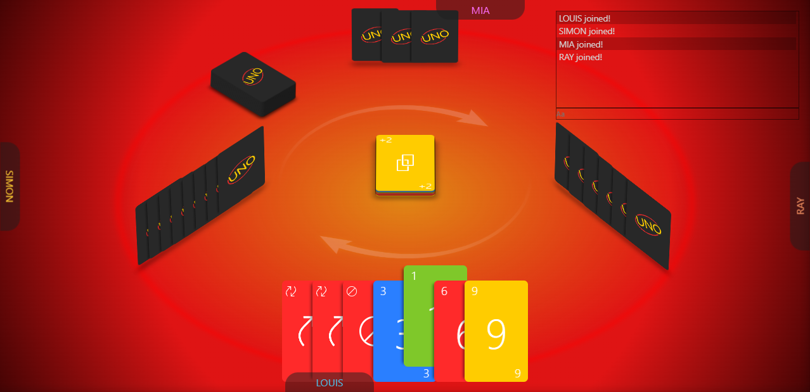

    

### About this project

Online multiplayer UNO game made in 2020 as a practice in:

- [React](https://reactjs.org/)
- [TypeScript](https://www.typescriptlang.org/)
- [Socket.IO](https://socket.io/)

### How to run

Client:

1. `cd client`
2. `npm i`
3. `npm start`

Server:

1. `cd server`
2. `npm i`
3. `npm start`

### Usage

You can use this project as you like. Feel free to make an issue if you have any questions :)

> I will probably come back to clean this project up in the future. In the meantime you can check out [millionairy](https://github.com/eals01/millionairy), a cleaner, up-to-date repo with similar functionality
